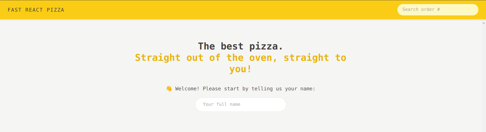
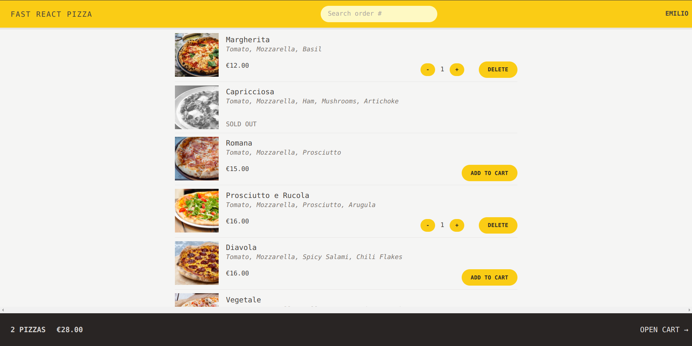
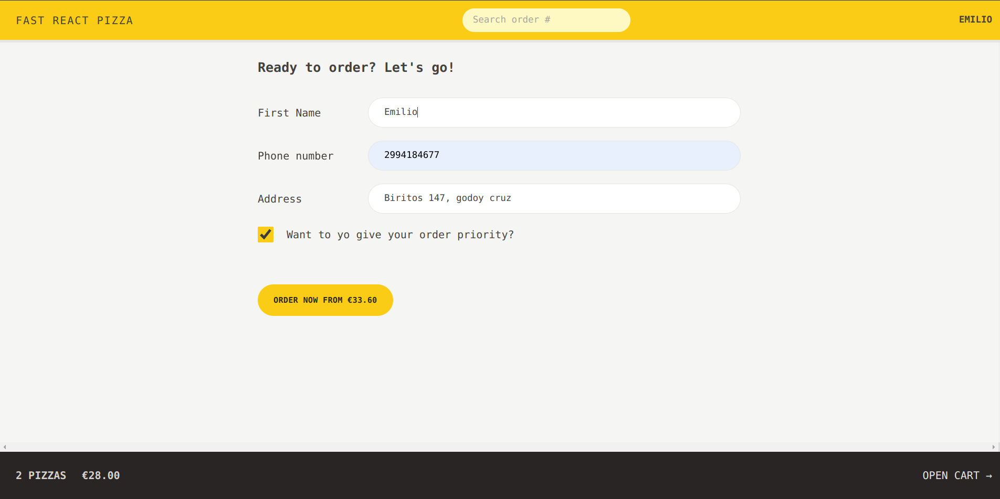
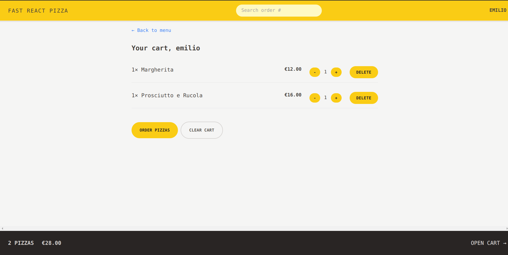
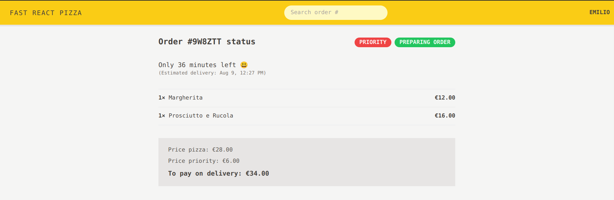

# Fast React Pizza

## Table of Contents
- [Overview](#overview)
- [Built With](#built-with)
- [Features](#features)
- [Acknowledgements](#acknowledgements)

## Overview
- A restaurant (business) needed a simple way of allowing customers to order pizzas and get them delivered to their home.
- We built the application front-end.
- It was built with React using Vite.
- You can try it out at [Vercel - Fast React Pizza](https://fast-react-pizza-five.vercel.app/)

### Built With
- Routing: React Router
- Styling: Tailwindcss
- Remote state management: React Router ("render-as-you-fetch" feature available from v6.4+)
- UI state management: Redux

## Features
- Very simple application, where users can order one or more pizzas from a menu.
- Requires no user accounts and no login: users just input their names before using the app.

- The pizza menu can change, so it should be loaded from an API (done).
- Users can add multiple pizzas to a cart before ordering.

- Ordering requires just the user’s name, phone number, and address.
- User’s can mark their order as “priority” for an additional 20% of the cart price.

- Orders are made by sending a POST request with the order data (user data + selected pizzas) to the API.
- Payments are made on delivery, so no payment processing is necessary in the app.

- Each order will get a unique ID that should be displayed, so the user can later look up their order based on the ID.
- Users should be able to mark their order as “priority” order even after it has been placed.

### From those requirements, the app needs these pages:
  1. Homepage
  2. Pizza menu
  3. Cart
  4. Placing a new order
  5. Looking up an order

## Acknowledgements
This project is part of The Ultimate React Course 2023: React, Redux & More by [Jonas Schmedtmann](http://jonas.io/).